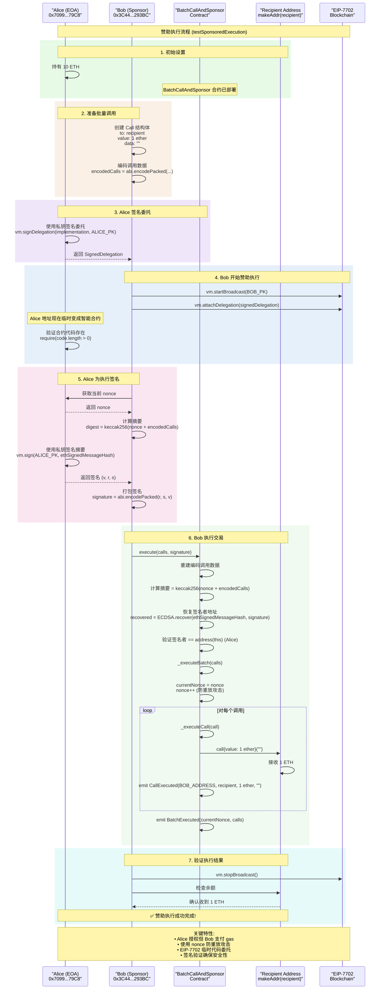

```mermaid
sequenceDiagram
    participant Alice as "Alice (EOA)<br/>0x7099...79C8"
    participant Bob as "Bob (Sponsor)<br/>0x3C44...293BC"
    participant Implementation as "BatchCallAndSponsor<br/>Contract"
    participant Recipient as "Recipient Address<br/>makeAddr(recipient)"
    participant Blockchain as "EIP-7702<br/>Blockchain"

    Note over Alice, Blockchain: 赞助执行流程 (testSponsoredExecution)
    
    rect rgb(230, 250, 230)
        Note over Alice, Recipient: 1. 初始设置
        Alice->>Alice: 持有 10 ETH
        Note over Implementation: BatchCallAndSponsor 合约已部署
    end

    rect rgb(250, 240, 230)
        Note over Alice, Bob: 2. 准备批量调用
        Bob->>Bob: 创建 Call 结构体<br/>to: recipient<br/>value: 1 ether<br/>data: ""
        Bob->>Bob: 编码调用数据<br/>encodedCalls = abi.encodePacked(...)
    end

    rect rgb(240, 230, 250)
        Note over Alice, Implementation: 3. Alice 签名委托
        Alice->>Alice: 使用私钥签名委托<br/>vm.signDelegation(implementation, ALICE_PK)
        Alice-->>Bob: 返回 SignedDelegation
    end

    rect rgb(230, 240, 250)
        Note over Bob, Blockchain: 4. Bob 开始赞助执行
        Bob->>Blockchain: vm.startBroadcast(BOB_PK)
        Bob->>Blockchain: vm.attachDelegation(signedDelegation)
        Note over Alice: Alice 地址现在临时变成智能合约
        Alice->>Alice: 验证合约代码存在<br/>require(code.length > 0)
    end

    rect rgb(250, 230, 240)
        Note over Alice, Bob: 5. Alice 为执行签名
        Bob->>Alice: 获取当前 nonce
        Alice-->>Bob: 返回 nonce
        Bob->>Bob: 计算摘要<br/>digest = keccak256(nonce + encodedCalls)
        Alice->>Alice: 使用私钥签名摘要<br/>vm.sign(ALICE_PK, ethSignedMessageHash)
        Alice-->>Bob: 返回签名 (v, r, s)
        Bob->>Bob: 打包签名<br/>signature = abi.encodePacked(r, s, v)
    end

    rect rgb(240, 250, 240)
        Note over Bob, Recipient: 6. Bob 执行交易
        Bob->>Implementation: execute(calls, signature)
        
        Implementation->>Implementation: 重建编码调用数据
        Implementation->>Implementation: 计算摘要 = keccak256(nonce + encodedCalls)
        Implementation->>Implementation: 恢复签名者地址<br/>recovered = ECDSA.recover(ethSignedMessageHash, signature)
        Implementation->>Implementation: 验证签名者 == address(this) (Alice)
        
        Implementation->>Implementation: _executeBatch(calls)
        Implementation->>Implementation: currentNonce = nonce<br/>nonce++ (防重放攻击)
        
        loop 对每个调用
            Implementation->>Implementation: _executeCall(call)
            Implementation->>Recipient: call{value: 1 ether}("")
            Recipient->>Recipient: 接收 1 ETH
            Implementation->>Implementation: emit CallExecuted(BOB_ADDRESS, recipient, 1 ether, "")
        end
        
        Implementation->>Implementation: emit BatchExecuted(currentNonce, calls)
    end

    rect rgb(230, 250, 250)
        Note over Bob, Recipient: 7. 验证执行结果
        Bob->>Blockchain: vm.stopBroadcast()
        Bob->>Recipient: 检查余额
        Recipient-->>Bob: 确认收到 1 ETH
        Note over Alice, Recipient: ✅ 赞助执行成功完成!
    end

    Note over Alice, Blockchain: 关键特性:<br/>• Alice 授权但 Bob 支付 gas<br/>• 使用 nonce 防重放攻击<br/>• EIP-7702 临时代码委托<br/>• 签名验证确保安全性
```