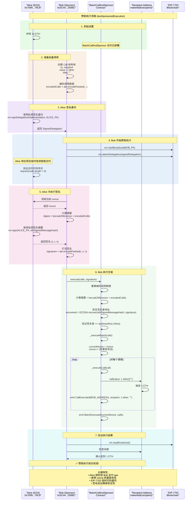

# BatchCallAndSponsor

An educational project demonstrating account abstraction and sponsored transaction execution using EIP-7702. This project uses Foundry for deployment, scripting, and testing.

## Overview

The `BatchCallAndSponsor` contract enables batch execution of calls by verifying signatures over a nonce and batched call data. It supports:
- **Direct execution**: by the smart account itself.
- **Sponsored execution**: via an off-chain signature (by a sponsor).

Replay protection is provided by an internal nonce that increments after each batch execution.

## Features

- Batch transaction execution
- Off-chain signature verification using ECDSA
- Replay protection through nonce incrementation
- Support for both ETH and ERC-20 token transfers

## Prerequisites

- [Foundry](https://github.com/foundry-rs/foundry)
- Solidity ^0.8.20

## Running the Project

### Step 1: Install Foundry

```sh
curl -L https://foundry.paradigm.xyz | bash
git clone https://github.com/quiknode-labs/qn-guide-examples.git
cd qn-guide-examples/ethereum/eip-7702
```

### Step 2: Install Packages and Create the Remappings File

```sh
forge install OpenZeppelin/openzeppelin-contracts
forge install foundry-rs/forge-std
forge remappings > remappings.txt
```

### Step 3: Run a Local Network

Run the following command on your terminal to start a local network with the Prague hardfork. 

```bash
anvil --hardfork prague
```

### Step 4: Build the Contract

On another terminal, run the following command to build the contract.

```bash
forge build
```

### Step 5: Run the Test Cases

After building the contract, run the following command to run the test cases. If you want to display stack traces for all tests, use `-vvvv` flag instead of `-vvv`.

```bash
forge test -vvv
```

The output should look like this:

```bash
Ran 4 tests for test/BatchCallAndSponsor.t.sol:BatchCallAndSponsorTest
[PASS] testDirectExecution() (gas: 128386)
Logs:
  Sending 1 ETH from Alice to Bob and transferring 100 tokens to Bob in a single transaction

[PASS] testReplayAttack() (gas: 114337)
Logs:
  Test replay attack: Reusing the same signature should revert.

[PASS] testSponsoredExecution() (gas: 110461)
Logs:
  Sending 1 ETH from Alice to a random address while the transaction is sponsored by Bob

[PASS] testWrongSignature() (gas: 37077)
Logs:
  Test wrong signature: Execution should revert with 'Invalid signature'.

Suite result: ok. 4 passed; 0 failed; 0 skipped;
```

#### Step 6: Run the Script

Now that you’ve set up the project, it’s time to run the deployment script. This script deploys the contract, mints tokens, and tests both batch execution and sponsored execution features.

We use the following command:
- **`--broadcast`**: Broadcasts the transactions to your local network.
- **`--rpc-url 127.0.0.1:8545`**: Connects to your local network.
- **`--tc BatchCallAndSponsorScript`**: Specifies the target contract for the script.

```bash
forge script ./script/BatchCallAndSponsor.s.sol --tc BatchCallAndSponsorScript --broadcast --rpc-url 127.0.0.1:8545
```